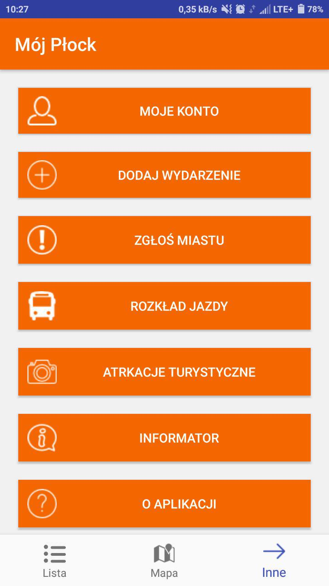
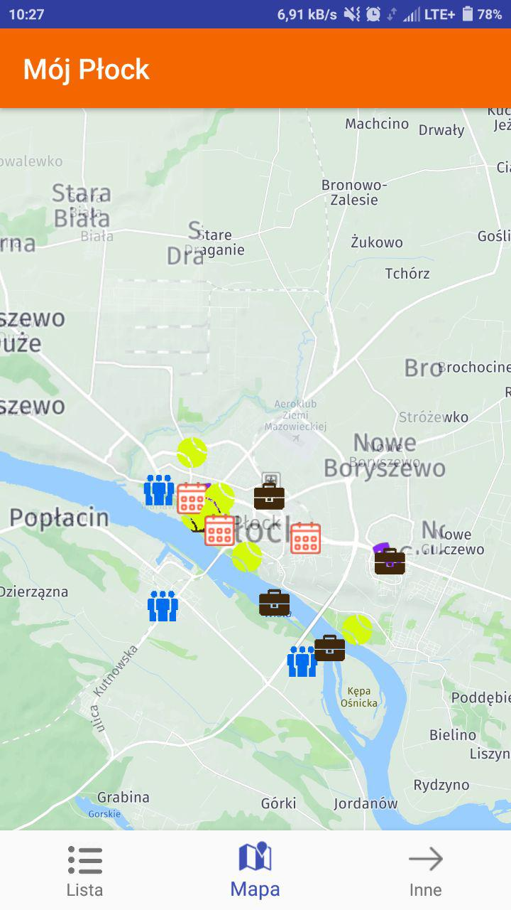
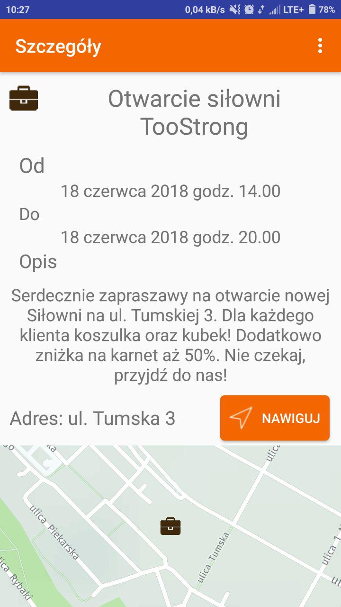

# MójPłock

Płock to bardzo żywe miasto, które stawia na nowoczesność i kontakt z mieszkańcami. 
Jednak mimo wszystko, kanałów komunikacji z „miastem” jest za dużo i są zbyt rozproszone.
Nasza aplikacja pozwala na rozwiązanie tego problemu.

